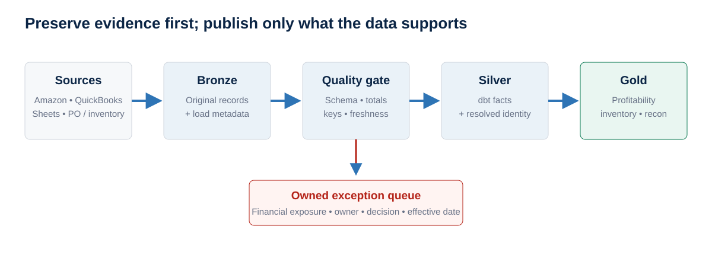
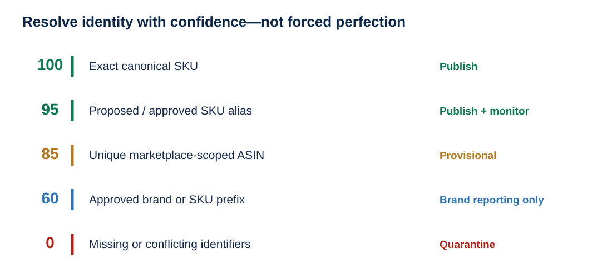
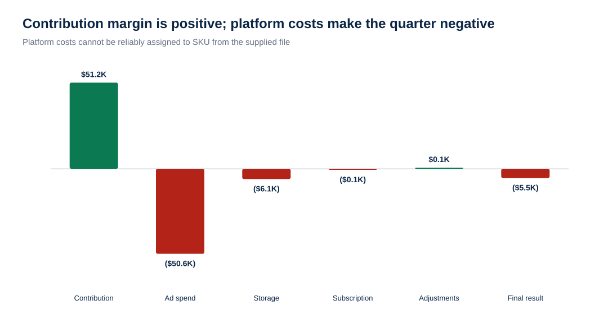
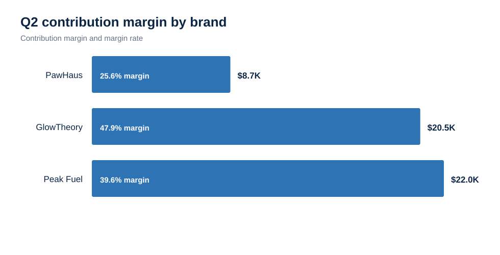
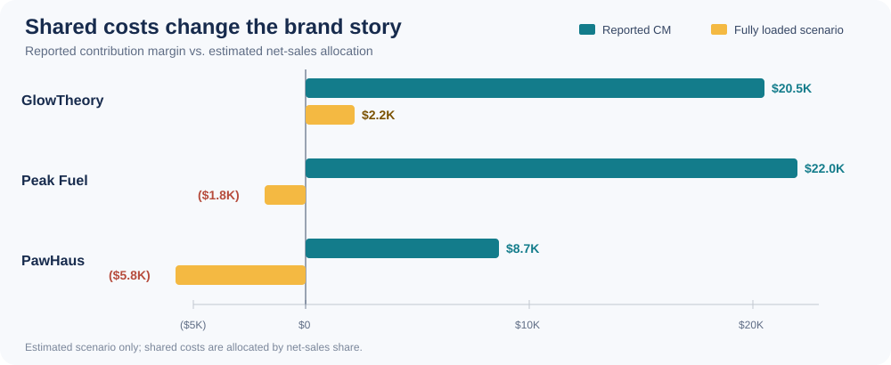
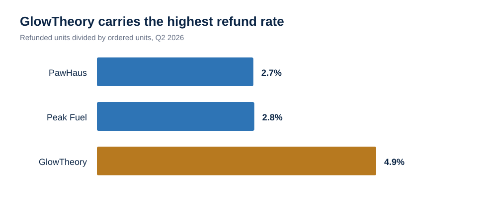

# Amazon Q2 2026 profitability assessment

This README is the presentation: a 20–25 minute leadership walkthrough of the requested data model, profitability analysis, and 90-day automation plan. Linked files provide the supporting detail and calculation receipts.

| Requested deliverable | Primary file | What it covers |
|---|---|---|
| **1. Data model** | [Written brief](deliverables/Amazon_Q2_2026_Assessment_Brief.docx) | BigQuery layers, keys, identity resolution, schema drift, and ongoing quality controls |
| **2. Profitability analysis** | [Analysis workbook](deliverables/Amazon_Q2_2026_Profitability_Analysis.xlsx) | Brand/SKU contribution margin, assumptions, exceptions, inventory, and reconciliations |
| **3. 90-day automation proposal** | [90-day plan](docs/automation_90_day_plan.md) | Ingestion, finance automation, REACH/inventory, ownership, and sequence |
| **Presentation** | **This README** | The complete narrative, examples, visuals, findings, and recommendations |

## 1. Data model: confidence before perfection

The model preserves every source record before applying business rules. Reporting tables receive only records that pass structural, financial, and identity checks.



Product identity is resolved once and carried into the facts. An exact SKU can establish product confidence even when ASIN is missing; a brand prefix can support brand reporting without forcing a product; a conflict remains visible in an exception queue.



**Publication rule:** publish high-confidence matches, warn on provisional matches within an agreed threshold, and quarantine conflicts with their dollar exposure and owner.

Supporting detail: [data model](docs/data_model.md) · [identity rules](docs/identity_resolution_and_confidence.md) · [schema drift and replay](docs/schema_drift_replay_and_validation.md) · [BigQuery SQL](sql/bigquery/)

## 2. Profitability analysis

Contribution margin is net product sales after refunds and promotions, less referral fees, FBA fulfillment fees, and landed COGS.

| Q2 result | Amount |
|---|---:|
| Net sales after refunds and promotions | **$132,341.93** |
| SKU-attributable contribution margin | **$51,242.63** |
| Contribution margin rate | **38.7%** |
| Result after SKU-less platform costs and adjustments | **($5,483.46)** |





### One transaction, traced from sale to contribution margin

Order `114-1003986-4269335` for `PH-BED-MED-GRY` shows how a profitable sale can become economically fragile before any shared advertising or storage allocation.

| Step | Source field | Amount |
|---|---|---:|
| Product sale | Settlement `product_sales` | **$42.99** |
| Promotion | Settlement `promotional_rebates` | **($4.30)** |
| Net product sales | Calculated | **$38.69** |
| Referral fee | Settlement `selling_fees` | **($5.80)** |
| FBA fulfillment fee | Settlement `fba_fees` | **($12.40)** |
| Landed COGS | PO weighted landed unit cost | **($19.70)** |
| **Contribution margin** | Calculated | **$0.79** |

The landed cost is supported by three PO lines totaling 1,300 units: $23,556.00 product cost plus $2,048.80 freight/duty equals $25,604.80, or **$19.696 per sellable unit**.

This transaction remains positive after attributable costs, but only **$0.79** of additional shared cost would erase its margin. The supplied advertising and storage rows have no SKU key, so the analysis does not claim that those costs belong to this order. At quarter level, the SKU generated **$291.44** of contribution margin; any defensible allocation above that amount would make the SKU negative.

Receipts: [transformed settlement rows](processed/settlement_transactions_transformed.csv) · [PO landed-cost summary](processed/po_unit_costs.csv) · [SKU profitability](processed/sku_profitability.csv)

### Management allocation scenario: directional, not reported profit

Yes, a blanket allocation is useful for management color if it is shown beside—not instead of—the auditable SKU contribution margin. This scenario distributes SKU-less advertising, FBA storage, subscription cost, and adjustment income by each SKU's share of Q2 net sales.

`SKU allocation share = SKU net sales / $132,341.93`

`Fully loaded scenario = reported contribution margin - allocated advertising - allocated storage - allocated subscription + allocated adjustment`

FBA **fulfillment** fees are not allocated again: the settlement already assigns those fees to SKU and they are included in reported contribution margin. Refund volume is also not a separate allocation driver because refunds already reduce net sales and contribution margin; using it again would double-penalize return-heavy products.

| Brand | Net sales | Reported contribution margin | Fully loaded scenario | Scenario margin |
|---|---:|---:|---:|---:|
| GlowTheory | $42,872.51 | $20,548.22 | **$2,171.66** | **5.1%** |
| Peak Fuel | $55,656.70 | $22,027.05 | **($1,829.23)** | **(3.3%)** |
| PawHaus | $33,812.72 | $8,667.36 | **($5,825.88)** | **(17.2%)** |
| **Total** | **$132,341.93** | **$51,242.63** | **($5,483.46)** | **(4.1%)** |



The scenario allocates $50,576.12 of advertising, $6,119.25 of storage, and $119.97 of subscription cost, offset by $89.25 of adjustment income. It reconciles exactly to the Amazon-level result, but it does **not** prove which SKU caused the cost.

#### Product example: PawHaus dog bed

| Q2 `PH-BED-MED-GRY` bridge | Amount |
|---|---:|
| Net sales after refunds and promotions | $4,776.16 |
| Reported contribution margin after referral, FBA fulfillment, and landed COGS | **$291.44** |
| Allocated advertising scenario | ($1,825.27) |
| Allocated FBA storage scenario | ($220.84) |
| Allocated subscription scenario | ($4.33) |
| Allocated adjustment income | $3.22 |
| **Fully loaded management scenario** | **($1,755.78)** |

This is the requested economic color: the dog bed is barely profitable on attributable unit economics and becomes negative under a transparent shared-cost scenario. It is a prioritization signal for better attribution—not a claim that Amazon billed exactly $1,825.27 of advertising to this SKU.

| Shared item | Current fallback | Better production driver |
|---|---|---|
| Advertising | Net-sales share | Campaign/ad-group spend tied to advertised ASIN/SKU |
| FBA storage | Net-sales share | SKU cubic-foot-days or average inventory volume |
| Subscription | Net-sales share; immaterial | Keep as account overhead unless leadership requires full absorption |
| Adjustment income | Net-sales share for reconciliation | Source-specific reason and product key when available |

Scenario receipts: [brand allocation](processed/allocated_profitability_scenario_by_brand.csv) · [SKU allocation](processed/allocated_profitability_scenario_by_sku.csv) · [reproducible script](analysis/allocate_shared_costs.py)

### Refund risk

Refund rate is measured as refunded units divided by ordered units. Contribution impact is the contribution margin reversed by refund rows.



| Brand | Brand refund rate | SKU requiring attention | SKU refund rate | Contribution-margin impact |
|---|---:|---|---:|---:|
| GlowTheory | **4.9%** | `GT-MASK-CLAY` | **10.7%** | **$143** reversed; equal to 28.9% of remaining SKU contribution margin |
| Peak Fuel | **2.8%** | `PF-WHEY-CHOC` | **3.4%** | **$328** reversed, the brand's largest refund impact |
| PawHaus | **2.7%** | `PH-BED-MED-GRY` | **6.6%** | **$138** reversed; equal to 47.2% of remaining SKU contribution margin |

**Insight:** GlowTheory has the broadest refund pressure, while the PawHaus dog bed is the clearest profitability risk because a modest number of refunds consumes nearly half of its remaining contribution margin. Investigate return reasons, listing expectations, and product quality before changing pricing or advertising.

Supporting detail: [brand refund analysis](processed/refund_analysis_by_brand.csv) · [SKU refund analysis](processed/refund_analysis_by_sku.csv)

### Leadership recommendations

1. **Replace allocation assumptions with attribution.** Advertising is 98.7% of reported contribution margin; ingest campaign/ASIN spend and SKU-level storage detail before making product decisions from fully loaded profit.
2. **Investigate refund erosion.** Start with `PH-BED-MED-GRY`, `GT-MASK-CLAY`, and `PF-WHEY-CHOC`; pair return reasons with contribution-margin impact.
3. **Close cost and inventory exceptions.** Confirm two imputed landed costs, then review two SKUs below 60 days of cover and slow movers holding more than one year of stock.

Supporting detail: [assumptions and limitations](docs/assumptions_and_limitations.md) · [data-quality register](processed/data_quality_register.csv) · [brand results](processed/brand_profitability.csv) · [SKU results](processed/sku_profitability.csv)

## 3. First 90 days


| Timing | Priority | Result |
|---|---|---|
| **Days 1–30** | Reliable ingestion, raw history, schema alerts, identity/UOM mappings, source tie-outs | Trusted and replayable data feeds |
| **Days 31–60** | Amazon management P&L, QuickBooks reconciliation, source drill-through | Repeatable finance reporting |
| **Days 61–90** | REACH PO/receipt history, advertising attribution, inventory and cash outlook | Operational decisions from dependable history |

Start with the cost-aware GCP option; use managed connectors when reliability or implementation speed justifies the recurring cost. See [architecture options](docs/architecture_options.md).

## Important assumptions and exceptions

- Refunds retain the Amazon signs and reverse sales, promotions, fees, units, and COGS.
- Advertising, storage, subscription fees, and adjustments remain below reported SKU contribution margin because no reliable SKU key was supplied; a separate net-sales allocation is presented only as an estimated management scenario.
- `PH-DENTAL-30CT` uses a 12-unit case-pack interpretation from the description.
- `GT-LIP-BALM` and `PH-TOY-ROPE-L` use temporary brand-median landed costs and remain flagged.
- `PF-ELECTRO-CITRUS` is treated as a proposed alias of `PF-ELECTRO-CIT` based on the supplied mapping.
- ASIN `B0GTRLRJDE` maps to two products, so it is blocked from ASIN-only joins.

## Reproduce the analysis

The analysis is reproducible with the four supplied assessment files. Generated outputs are included for reviewers who do not have those source extracts.

```powershell
pip install -r requirements.txt

python analysis/profitability_analysis.py `
  --mapping "<path>/sku_asin_brand_mapping.csv" `
  --purchase-orders "<path>/purchase_orders_landed_cost.csv" `
  --inventory "<path>/inventory_snapshot_2026-06-30.csv" `
  --settlements "<path>/amazon_settlements_apr-jun_2026.csv" `
  --output-dir processed

python analysis/identity_resolution_audit.py `
  --transactions processed/settlement_transactions_transformed.csv `
  --output-dir processed

python analysis/allocate_shared_costs.py `
  --sku-profitability processed/sku_profitability.csv `
  --platform-overhead processed/platform_overhead.csv `
  --output-dir processed

python analysis/build_repo_charts.py
```
