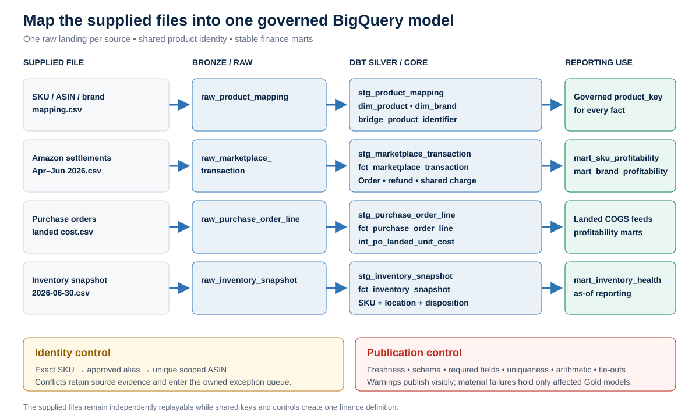
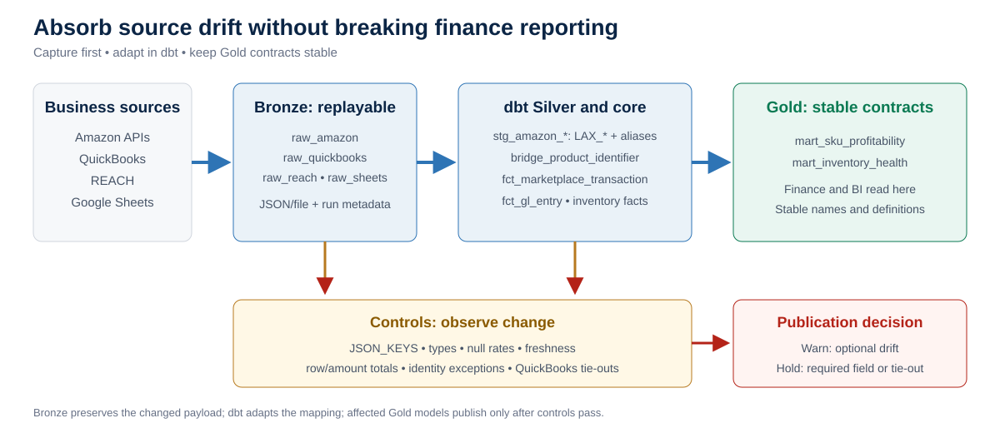

# Amazon Q2 2026 profitability assessment

This README is the 20–25 minute presentation. Links provide calculation receipts and implementation detail.

| Deliverable | Primary evidence |
|---|---|
| **1. BigQuery data model** | [Model](docs/data_model.md) · [identity rules](docs/identity_resolution_and_confidence.md) · [drift/replay](docs/schema_drift_replay_and_validation.md) |
| **2. Profitability analysis** | [Workbook](deliverables/Amazon_Q2_2026_Profitability_Analysis.xlsx) · [brand results](processed/brand_profitability.csv) · [24 SKU results](processed/sku_profitability.csv) |
| **3. 90-day automation plan** | [Plan](docs/automation_90_day_plan.md) · [architecture](docs/architecture_options.md) |
| **Supporting files** | [Written brief](deliverables/Amazon_Q2_2026_Assessment_Brief.docx) · [BigQuery SQL](sql/bigquery/) |

## 1. BigQuery model: confidence before perfection

**Method:** preserve raw evidence, resolve identity once, and expose only controlled reporting models.


### How the supplied files become governed models

Each assessment file has one replayable landing and one controlled path into shared finance models.



Settlement and PO facts converge in profitability; the inventory snapshot remains an as-of operational fact.

Exact canonical SKU can identify a product; a prefix can suggest only its brand. Conflicts remain visible.


**Publish:** high-confidence matches proceed, provisional matches warn, and conflicts quarantine with owner and dollar exposure.

## 2. Q2 profitability

`Contribution margin = net product sales after refunds/promotions − referral fees − FBA fulfillment − landed COGS`

| Q2 result | Amount |
|---|---:|
| Net sales after refunds and promotions | **$132,341.93** |
| SKU-attributable contribution margin | **$51,242.63** |
| Contribution margin rate | **38.7%** |
| Result after SKU-less platform costs and adjustments | **($5,483.46)** |


### Transaction receipt

Order `114-1003986-4269335`, SKU `PH-BED-MED-GRY`:

| Step | Source | Amount |
|---|---|---:|
| Product sale | Settlement `product_sales` | $42.99 |
| Promotion | Settlement `promotional_rebates` | ($4.30) |
| Net product sales | Calculated | $38.69 |
| Referral fee | Settlement `selling_fees` | ($5.80) |
| FBA fulfillment | Settlement `fba_fees` | ($12.40) |
| Landed COGS | PO weighted landed cost | ($19.70) |
| **Contribution margin** | Calculated | **$0.79** |

Landed cost receipt: ($23,556.00 product + $2,048.80 freight/duty) ÷ 1,300 units = **$19.696 per unit**.

[Settlement rows](processed/settlement_transactions_transformed.csv) · [PO costs](processed/po_unit_costs.csv) · [SKU results](processed/sku_profitability.csv)

### Data-quality decisions

| Issue found | Resolution used |
|---|---|
| Missing PO cost: `GT-LIP-BALM`, `PH-TOY-ROPE-L` | Used flagged brand-median landed cost; validate before posted reporting |
| `PH-DENTAL-30CT` ordered by case | Converted each case to 12 sellable units before unit-cost calculation |
| `PF-ELECTRO-CITRUS` alias | Mapped through an auditable alias to `PF-ELECTRO-CIT` |
| ASIN `B0GTRLRJDE` identifies two products | Joined by approved SKU and blocked ASIN-only matching |
| Advertising, storage, and subscription lack SKU keys | Kept below reported SKU CM; allocated only in the labeled management scenario |

[Full quality register](processed/data_quality_register.csv) · [assumptions and limitations](docs/assumptions_and_limitations.md)

### Fully loaded management scenario

SKU-less costs are allocated by net-sales share for direction—not reported SKU profit.

`Allocation share = SKU net sales ÷ $132,341.93`

`Allocated advertising = $50,576.12 × brand net sales share`

FBA fulfillment is not reallocated; refunds already reduce net sales and contribution margin.

| Brand | Net sales | Reported CM | Allocated advertising | Fully loaded scenario | Scenario margin |
|---|---:|---:|---:|---:|---:|
| GlowTheory | $42,872.51 | $20,548.22 | ($16,384.26) | **$2,171.66** | **5.1%** |
| Peak Fuel | $55,656.70 | $22,027.05 | ($21,269.90) | **($1,829.23)** | **(3.3%)** |
| PawHaus | $33,812.72 | $8,667.36 | ($12,921.95) | **($5,825.88)** | **(17.2%)** |
| **Total** | **$132,341.93** | **$51,242.63** | **($50,576.12)** | **($5,483.46)** | **(4.1%)** |

Brand rows are rounded; unrounded allocations reconcile to $50,576.12.


Fully loaded result also deducts allocated storage and subscription, then adds adjustment income. See the linked brand scenario for every component.

| Dog-bed Q2 example | Amount |
|---|---:|
| Net sales | $4,776.16 |
| Reported contribution margin | $291.44 |
| Net shared-cost allocation | ($2,047.22) |
| **Fully loaded scenario** | **($1,755.78)** |

This flags economic risk; it does not claim actual SKU-level advertising. Preferred production drivers are advertised-ASIN spend and SKU cubic-foot-days.

[Brand scenario](processed/allocated_profitability_scenario_by_brand.csv) · [SKU scenario](processed/allocated_profitability_scenario_by_sku.csv) · [script](analysis/allocate_shared_costs.py)

### Refund risk

`Refund rate = refunded units ÷ ordered units`

| Brand | Brand rate | Highest-risk SKU | SKU rate | CM effect |
|---|---:|---|---:|---:|
| GlowTheory | **4.9%** | `GT-MASK-CLAY` | **10.7%** | $143 reversed; 28.9% of remaining SKU CM |
| Peak Fuel | **2.8%** | `PF-WHEY-CHOC` | **3.4%** | $328 reversed |
| PawHaus | **2.7%** | `PH-BED-MED-GRY` | **6.6%** | $138 reversed; 47.2% of remaining SKU CM |


**Top recommendations**

1. Replace shared-cost estimates with advertised-ASIN and SKU-storage data or use historical benchmarks by brand to use some form of attribution.
2. Investigate dog-bed, clay-mask, and chocolate-whey return reasons.
3. Confirm two imputed costs and act on inventory-cover exceptions.

[Refund detail](processed/refund_analysis_by_sku.csv) · [assumptions](docs/assumptions_and_limitations.md) · [quality register](processed/data_quality_register.csv)

## 3. First 90 days

QuickBooks, REACH, and Sheets are business sources. BigQuery is the warehouse; dbt transforms, tests, and documents models.



| Timing | Priority | Outcome |
|---|---|---|
| **Days 1–30: protect** | Catalog Amazon, QuickBooks, REACH, and Sheet feeds; profile REACH; retain raw history/run metadata; add freshness, drift, volume, null, retry, and replay controls | Recoverable feeds and visible source changes |
| **Days 31–60: stabilize** | Build dbt Silver/Core models with `LAX_*` parsing and approved rename aliases; add identity tests, Gold contracts, and QuickBooks reconciliation | Stable profitability reporting with drill-through |
| **Days 61–90: close gaps** | Add missing advertising, storage, returns, PO/receipt, and inventory data; use REACH where confirmed; assign owners and test replay | Better SKU economics and an operating runbook |

**Drift rule:** Bronze retains changed payloads. Optional keys warn; missing required fields, null spikes, or failed financial tie-outs hold only affected Gold models. API outages still require retries and replay.

[Detailed plan](docs/automation_90_day_plan.md) · [model](docs/data_model.md) · [drift controls](docs/schema_drift_replay_and_validation.md)

## Key assumptions

- Refund signs reverse sales, promotions, fees, units, and COGS.
- Shared costs remain below reported SKU CM; allocations are estimated.
- `PH-DENTAL-30CT` uses a 12-unit case pack.
- `GT-LIP-BALM` and `PH-TOY-ROPE-L` use flagged brand-median costs.
- `PF-ELECTRO-CITRUS` aliases `PF-ELECTRO-CIT`.
- Duplicate ASIN `B0GTRLRJDE` is blocked from ASIN-only joins.

## Reproduce

```powershell
pip install -r requirements.txt

python analysis/profitability_analysis.py `
  --mapping "<path>/sku_asin_brand_mapping.csv" `
  --purchase-orders "<path>/purchase_orders_landed_cost.csv" `
  --inventory "<path>/inventory_snapshot_2026-06-30.csv" `
  --settlements "<path>/amazon_settlements_apr-jun_2026.csv" `
  --output-dir processed

python analysis/identity_resolution_audit.py `
  --transactions processed/settlement_transactions_transformed.csv `
  --output-dir processed

python analysis/allocate_shared_costs.py
python analysis/build_repo_charts.py
```

## AI-use disclosure

OpenAI Codex 5.6 Sol assisted with documentation, pipeline-design examples, and illustrative SQL/Python. I reviewed the analysis and remain responsible for its conclusions. Production dbt/SQL would be authored, tested, and adapted by me after inspecting the actual BigQuery datasets, source contracts, and business rules; repository examples are not represented as deployed production code.
