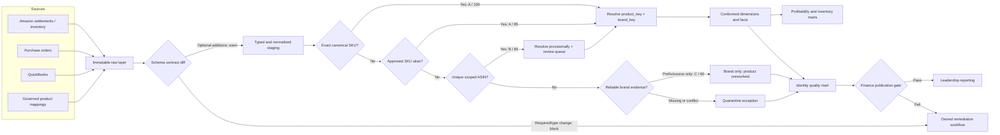

# Amazon Q2 2026 Profitability Assessment

A finance-ready assessment of Amazon contribution margin, inventory signals, data quality, and a scalable BigQuery foundation. The repository separates numerical evidence, presentation deliverables, and production-oriented implementation patterns.

## Start here: assessment deliverables

| Deliverable | Use in the review | File |
|---|---|---|
| Leadership presentation | 20–25 minute decision narrative | [PPTX](deliverables/Amazon_Q2_2026_Leadership_Presentation.pptx) |
| Profitability workbook | Brand/SKU drill-down, inventory, checks, and assumptions | [XLSX](deliverables/Amazon_Q2_2026_Profitability_Analysis.xlsx) |
| Assessment brief | Data model, findings, assumptions, and 90-day plan | [DOCX](deliverables/Amazon_Q2_2026_Assessment_Brief.docx) |
| Identity-resolution playbook | Join rules, confidence grades, exceptions, and controls | [Markdown](docs/identity_resolution_and_confidence.md) |
| Schema-drift control | Contract diffs, alerts, snapshots, replay, and dedup audit | [Markdown](docs/schema_drift_replay_and_validation.md) |
| BigQuery implementation | Staging, dimensions, marts, identity controls, and tests | [SQL folder](sql/bigquery/) |
| Databricks demonstration | Portable lakehouse implementation example | [Notebook source](databricks/assessment_demo.py) |

The four raw assessment CSV files are intentionally excluded from the public repository. Generated tables in `processed/` preserve the evidence needed to review the calculations without publishing the source extracts.

## Direct mapping to the assignment

| Requested deliverable | Primary submission | Supporting evidence |
|---|---|---|
| **1. Data model** | [BigQuery data model](docs/data_model.md) and the diagrams below | [Identity/join controls](docs/identity_resolution_and_confidence.md), [schema-drift controls](docs/schema_drift_replay_and_validation.md), [BigQuery SQL](sql/bigquery/) |
| **2. Profitability analysis** | [Verified workbook](deliverables/Amazon_Q2_2026_Profitability_Analysis.xlsx) | [Assessment brief](deliverables/Amazon_Q2_2026_Assessment_Brief.docx), generated CSVs, reproducible Python |
| **3. First-90-day automation proposal** | [One-page proposal](docs/automation_90_day_plan.md) | [Premium vs. cost-aware architectures](docs/architecture_options.md) |

The calculations are evidence for Deliverable 2. The submission narrative is organized around the three requested decisions: how to structure the data, what the economics say, and what to automate first.

## Executive result

- Net sales after refunds and promotions: **$132.3K**.
- SKU-attributable CM1: **$51.2K**, or **38.7%**.
- SKU-less advertising, storage, and subscription charges consume the contribution pool; including those items and adjustments produces an estimated **$5.5K loss after platform overhead**.
- Two SKUs lack PO cost history. Brand-median landed costs are used, flagged, and isolated from observed costs.

## Data flow and identity-control gates



Important principle: a missing ASIN does **not** reduce product confidence when an approved SKU resolves the row. Product, brand, and ASIN confidence are stored separately so one weak attribute cannot contaminate a strong join.

## Join contract

| Priority | Rule | Result | Product confidence | Permitted use |
|---:|---|---|---:|---|
| 1 | Exact normalized SKU in the approved, effective-dated bridge | Canonical product + brand | A / 100 | Finance marts |
| 2 | Exact approved SKU alias | Canonical product + brand | A / 95 | Finance marts; monitor alias volume |
| 3 | ASIN unique within marketplace/account/date scope | Provisional product + brand | B / 85 | Publish only under materiality threshold and review SLA |
| 4 | Approved source brand or SKU-prefix rule | Brand only | C / 60 | Aggregate exception reporting only |
| 5 | Missing or conflicting identifiers | Unresolved | F / 0 | Quarantine; never force-join |

Fuzzy text similarity may suggest candidates to a steward, but it never auto-posts a finance foreign key.

## Current identity-confidence snapshot

| Dimension / method | Grade | Rows | % rows | Net sales | % sales | Decision |
|---|---:|---:|---:|---:|---:|---|
| Product: exact canonical SKU | A / 100 | 4,552 | 98.87% | $130,989.56 | 98.98% | Publish |
| Product: approved SKU alias | A / 95 | 52 | 1.13% | $1,352.37 | 1.02% | Publish; monitor |
| Brand: approved product mapping | A / 100 | 4,604 | 100.00% | $132,341.93 | 100.00% | Publish |
| ASIN: unique, enriched from resolved SKU | B / 90 | 4,384 | 95.22% | $129,173.74 | 97.61% | Publish as attribute |
| ASIN: conflicting mapping | F / 0 | 220 | 4.78% | $3,168.19 | 2.39% | Block ASIN-only joins |

The conflicting ASIN is `B0GTRLRJDE`, assigned to both `GT-ROLLER-JADE` and `PH-BRUSH-DBL`. SKU remains authoritative for these transactions. See the generated [coverage report](processed/identity_resolution_coverage.csv) and [exception report](processed/identity_resolution_exceptions.csv).

## Repository map

```text
analysis/        Reproducible profitability and identity-audit scripts
contracts/       Versioned source-schema contracts used by drift gates
databricks/      Databricks notebook source showing the lakehouse implementation
deliverables/    Verified workbook, written brief, and leadership presentation
docs/            Data model, identity playbook, automation plan, assumptions, AI use
processed/       Generated analysis tables, coverage metrics, and exception registers
sql/bigquery/    Staging, dimensions, marts, identity controls, and quality tests
```

## Run locally

```powershell
python analysis/profitability_analysis.py `
  --mapping "<path>/sku_asin_brand_mapping.csv" `
  --purchase-orders "<path>/purchase_orders_landed_cost.csv" `
  --inventory "<path>/inventory_snapshot_2026-06-30.csv" `
  --settlements "<path>/amazon_settlements_apr-jun_2026.csv" `
  --output-dir processed

python analysis/identity_resolution_audit.py `
  --transactions processed/settlement_transactions_transformed.csv `
  --output-dir processed

python analysis/schema_contract_audit.py `
  "<path>/amazon_settlements_apr-jun_2026.csv" `
  contracts/amazon_settlements.schema.json
```

Dependencies: Python 3.11+, pandas, and NumPy.

## Platform recommendation

For a finance team already using Google Sheets, **BigQuery + dbt/Dataform + Looker Studio/Connected Sheets** is the lower-friction production choice. Databricks remains a credible option if the company already operates a lakehouse or expects material streaming, ML, or multi-channel engineering requirements. The interview story should lead with reconciled economics and controlled decisions; the platform is the implementation vehicle.

Two implementation paths are provided:

- **Efficient / cost-aware — recommended starting point:** native Google Cloud serverless ingestion, BigQuery, Dataform, and Connected Sheets/Looker Studio. Lowest recurring software footprint; more ownership of API connectors.
- **Premium / managed:** managed Amazon and QuickBooks ingestion, BigQuery, dbt Cloud, managed observability, and Looker. Faster connector deployment and stronger enterprise operations; materially higher subscription cost.

Both paths use the same Bronze → Silver → Gold contracts, so the company can begin cost-aware and replace ingestion/orchestration components without redesigning the finance model.
