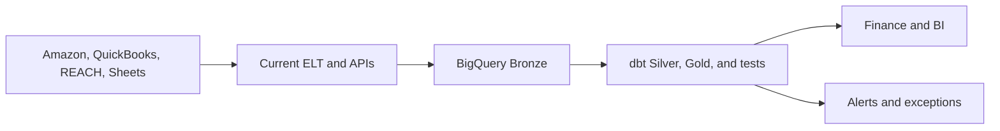

# Implementation around the existing BigQuery and dbt stack

The company already uses third-party ingestion, BigQuery, and dbt. The first decision is not a platform replacement; it is how to close ingestion and control gaps without creating duplicate infrastructure.

## Recommended: extend the current stack

- Inventory current endpoints, history, refresh schedules, owners, and raw-payload retention.
- Keep the connector where coverage and reliability are acceptable.
- Add dbt source freshness, tests, contracts, lineage, and reconciliation models.
- Add BigQuery Scheduled Queries and Cloud Monitoring for payload-drift and cross-model alerts.
- Profile REACH during discovery and use it only for the entities it is confirmed to own.

## Selective custom ingestion

Use Cloud Scheduler/Run or another small batch service only where the current connector cannot provide a critical Amazon endpoint, raw history, or reliable backfill.

This avoids replacing a functioning connector while preserving one transformation and reporting layer.

## Rules in either path

| Part | Rule |
|---|---|
| Raw data | Keep source payload/file, load metadata, row hash, and contract version |
| Transformations | Use dbt to type fields, resolve identifiers, apply UOM rules, and preserve lineage |
| Reporting | BI connects only to documented Gold models |
| Controls | Test freshness, payload drift, duplicates, mappings, null rates, and financial tie-outs |
| Sheets | Treat Sheets as governed inputs and save dated copies to BigQuery |

## Recommendation

Start with the existing ELT → BigQuery → dbt path. Add custom ingestion only for confirmed gaps, and keep every new model and test inside the existing dbt project. Reassess connector vendors only if missing coverage, failed backfills, or support burden exceeds an agreed service level.

## References

- [dbt and BigQuery quickstart](https://docs.getdbt.com/guides/bigquery)
- [dbt source freshness](https://docs.getdbt.com/reference/resource-properties/freshness)
- [BigQuery JSON data](https://docs.cloud.google.com/bigquery/docs/json-data)
- [BigQuery scheduled-query alerts](https://docs.cloud.google.com/bigquery/docs/create-alert-scheduled-query)
