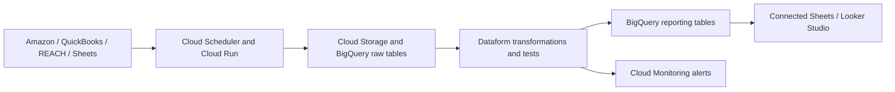
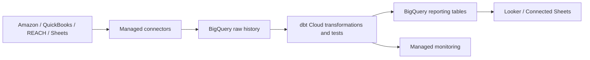

# Two ways I would implement the model

I included two options because the assignment asks what I would automate, but the right tool choice depends on budget and who will maintain the connectors. The BigQuery tables, calculations, and controls stay the same in both options.

## Option A: cost-aware Google Cloud setup

I would start here if a small team can support a few batch API jobs.

- Lower recurring software cost.
- Keeps the stack close to BigQuery and Google Sheets.
- The team owns Amazon API changes, rate limits, backfills, and REACH ingestion.
- Raw files and run metadata make failed loads replayable.

## Option B: managed connectors

I would choose this when faster implementation and lower connector maintenance are worth the subscription cost.

- Managed Amazon and QuickBooks ingestion reduces custom connector work.
- dbt Cloud and a monitoring tool provide scheduling, testing, documentation, and alerts.
- The tradeoff is higher recurring cost and more vendor dependence.
- I would still keep raw data in BigQuery and transformation code in version control.

## What stays the same

| Part | Rule in either option |
|---|---|
| Raw data | Keep the source record, load metadata, row hash, and schema version |
| Transformations | Type fields, resolve identifiers, apply UOM rules, and preserve source lineage |
| Reporting | Use the same contribution-margin and inventory definitions |
| Controls | Test freshness, schema changes, duplicates, mappings, and financial tie-outs |
| Google Sheets | Treat the Sheet as an input and save scheduled versions to BigQuery |

## My recommendation

I would begin with Option A. The current use case is batch-oriented, the business already uses Google Sheets, and BigQuery is the requested reporting foundation. A reasonable middle ground is to buy managed Amazon and QuickBooks ingestion while keeping Dataform and the reporting model in Google Cloud.

I would revisit the managed option if connector failures consume too much team time or if leadership requires stronger service levels and lineage than the native setup provides.

## Product references

- [Dataform overview](https://docs.cloud.google.com/dataform/docs/overview)
- [Connected Sheets](https://docs.cloud.google.com/bigquery/docs/connected-sheets)
- [Fivetran Amazon Selling Partner setup](https://fivetran.com/docs/connectors/applications/amazon-selling-partner/setup-guide)
- [Fivetran QuickBooks connector](https://fivetran.com/docs/connectors/applications/quickbooks)
