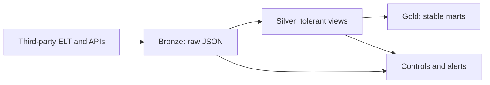

# Deliverable 3: first 90 days

## Starting point

Some Amazon data already reaches BigQuery through third-party APIs and ELT. I would keep that working path, document what it covers, and add a control layer around it. Missing Amazon endpoints, QuickBooks, REACH, and governed Google Sheets would feed the same model.

## Operating design



| Layer | Purpose | BigQuery approach |
|---|---|---|
| **Bronze** | Preserve source evidence | Append-only `JSON` payload plus source, endpoint, account, report window, extraction time, connector run ID, and payload hash |
| **Silver** | Normalize without hiding errors | Dataform views/tables using `LAX_INT64`, `LAX_FLOAT64`, and approved rename fallbacks such as `COALESCE(new_field, old_field)` |
| **Gold** | Protect finance and BI | Stable, documented columns; dashboards connect only here |
| **Controls** | Detect and recover | Run history, JSON-key profiles, null/volume tests, reconciliations, exceptions, retries, and replay |

Bronze is **capture first**, not “nothing can fail.” Authentication, rate limits, network issues, and connector outages still require retries and alerts. The advantage is that a new payload field or type does not destroy the source evidence.

If the current connector only delivers flattened tables, I would first confirm whether it can also retain the source JSON. If not, I would add raw capture for the highest-value endpoints or require raw-payload retention when the connector is renewed.

## Sequence

| Timing | Work | Exit criteria |
|---|---|---|
| **Days 1–30: observe and protect** | Inventory endpoints, owners, refresh times, history, and gaps. Add raw JSON landing for critical feeds, run metadata, schema-key snapshots, retries/backfill, and initial freshness/volume alerts. Define SKU/ASIN/UOM ownership. | Critical feeds are replayable; failures and payload changes are visible; no source row is silently discarded. |
| **Days 31–60: stabilize and reconcile** | Build Silver models with tolerant parsing and versioned rename rules. Add required-field, uniqueness, null-rate, identity, and amount tests. Publish stable Gold marts and reconcile Amazon activity to QuickBooks. | Brand/SKU profitability ties to source and accounting within approved tolerances; BI reads only Gold. |
| **Days 61–90: close gaps and operate** | Add advertising-by-ASIN, storage detail, return reasons, REACH PO/receipt status, and governed Sheet history. Assign alert owners, write runbooks, test replay, and review service levels. | Fully loaded SKU economics use better drivers; inventory uses actual receipts/status; the team can recover a failed load without engineering heroics. |

## Drift and quality rules

| Signal | Example | Response |
|---|---|---|
| **Information** | JSON/CSV field order changes | Record only; parse by key or header name |
| **Warning** | Optional key added or type mix increases | Keep Bronze loading; open a review item |
| **Error** | Required key missing, renamed, or mostly null | Keep Bronze; stop the affected Silver/Gold model |
| **Critical** | Source total or QuickBooks tie-out breaches finance materiality | Stop publication and alert finance/data owners |

For native JSON, field drift is detected from `JSON_KEYS(payload, mode => 'lax recursive')`, not `INFORMATION_SCHEMA.COLUMNS`, because the table still has one stable JSON column. Silver extraction health then catches the “null trap”: a tolerant cast can keep running while returning more nulls.

Example Silver pattern:

```sql
COALESCE(
  LAX_FLOAT64(payload.total_revenue),
  LAX_FLOAT64(payload.revenue_total)
) AS total_revenue
```

The fallback is versioned and temporary; a new field is not accepted automatically merely because it has a similar name.

## Low-noise monitoring

BigQuery Scheduled Queries return only breached tests. Cloud Monitoring alerts when the result row count is greater than zero. Dataform assertions cover model-level uniqueness, non-null, relationship, and reconciliation rules.

Start with four alerts per critical feed:

- Missing or late load versus the agreed SLA.
- Material row-count or financial-total change versus a comparable baseline.
- Required-field null rate above its threshold or sharply above its trailing baseline.
- Added, removed, or type-shifted JSON keys.

Each alert includes source, endpoint, run ID, affected field, first-seen time, row and dollar exposure, owner, and replay instructions.

## Day-90 measures

- At least 95% of scheduled feeds arrive and pass source checks.
- At least 99.5% of net sales resolves to an approved product and brand; the remainder has an owner.
- Amazon activity reconciles to QuickBooks within an agreed tolerance.
- Monthly channel-P&L preparation time falls by at least 50%.
- One failed load and one schema-change scenario are successfully replayed in a controlled test.

I would defer real-time streaming, broad platform replacement, advanced forecasting, and alerts for every optional field until daily loads and month-end reconciliation are dependable.

## BigQuery references

- [Work with JSON data](https://docs.cloud.google.com/bigquery/docs/json-data)
- [JSON functions: `JSON_KEYS` and `LAX_*`](https://docs.cloud.google.com/bigquery/docs/reference/standard-sql/json_functions)
- [Scheduled-query alerts with Cloud Monitoring](https://docs.cloud.google.com/bigquery/docs/create-alert-scheduled-query)
- [Dataform assertions](https://docs.cloud.google.com/dataform/docs/assertions)
