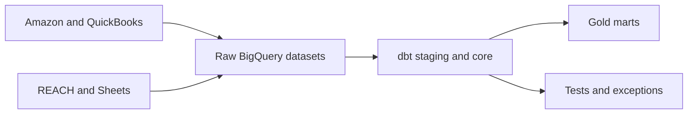

# Deliverable 1: proposed BigQuery data model

The goal is to trace every reported number to the source record and transformation rule. The design extends the company's existing BigQuery and dbt stack.

## Layers

| Layer | BigQuery datasets | Contents |
|---|---|---|
| **Bronze / raw** | `raw_amazon`, `raw_quickbooks`, `raw_reach`, `raw_sheets` | Source payload or file plus load time, endpoint/report, run ID, row hash, and contract version |
| **Silver / staging** | `stg_finance` | dbt models for typed fields, normalized identifiers, UOM rules, and source validation |
| **Silver / core** | `core_finance` | Shared dimensions, identifier bridges, and transaction facts |
| **Gold / reporting** | `mart_finance`, `mart_operations` | Profitability, inventory, reconciliation, and cash reporting |
| **Controls** | `dq_monitoring`, `quarantine` | Load history, dbt test results, drift events, unresolved records, and dollar exposure |

## Supplied-data lineage

The four assessment files land independently, then share governed product identity and publication controls.

Settlement and PO facts converge in the profitability marts. The inventory snapshot remains a separately grained as-of fact.

REACH is the financial reporting system. Profile its report definitions, adjustments, source lineage, refreshes, keys, and API/exports before using its outputs in Gold reconciliation.

## Main tables and keys

| Table | Grain | Key or join |
|---|---|---|
| `dim_product` | One version of a sellable product | `product_key`; canonical SKU and effective dates |
| `bridge_product_identifier` | One SKU, alias, ASIN, or UPC version | type + value + marketplace + effective dates |
| `dim_brand` | One brand | `brand_key` |
| `fct_marketplace_transaction` | One Amazon settlement row | source report/file + source row key |
| `fct_purchase_order_line` | One PO line/version | PO number + line + source update |
| `fct_inventory_snapshot` | SKU + location + disposition + snapshot time | composite source key |
| `fct_inventory_receipt` | One receipt/shipment line | source receipt/shipment line ID |
| `fct_advertising_spend` | Date + campaign/ad group/advertised product | advertising source ID |
| `fct_gl_entry` | One QuickBooks transaction line | transaction ID + line ID |
| `mart_sku_profitability_daily` | Date + SKU + channel | reporting composite key |
| `mart_inventory_health_daily` | Date + SKU + location | reporting composite key |

Facts retain source IDs, row hashes, and selected business-rule versions for drill-through.

## Identity resolution

Resolve exact canonical SKU first, then approved alias, then a unique marketplace-scoped ASIN. A prefix can suggest a brand but cannot create a product match. Conflicts remain unresolved with their dollar exposure and owner.

The fact stores `product_key`, `brand_key`, selected rule, and separate confidence results for product, brand, and ASIN. See [identifier matching and confidence](identity_resolution_and_confidence.md).

## Checks on every build

1. Confirm source freshness, payload keys/types, row counts, and financial totals.
2. Test source-key uniqueness and log possible business duplicates separately.
3. Confirm identifiers resolve to no more than one active product.
4. Tie settlement components to totals and PO components to landed cost.
5. Require a product mapping and cost for sold SKUs, or create an exception.
6. Reconcile Gold totals to Silver and, when available, QuickBooks.

Missing required fields, material reconciliation differences, or ambiguous product matches stop the affected Gold model. Smaller issues publish with a visible warning.

## Tool choice

Keep the current third-party ELT for covered Amazon, QuickBooks, REACH, and Sheet feeds; BigQuery for storage/compute; and dbt for transformations, tests, lineage, and documentation. Add native GCP jobs only for uncovered endpoints, raw-payload retention, or monitoring gaps. See [architecture options](architecture_options.md).
