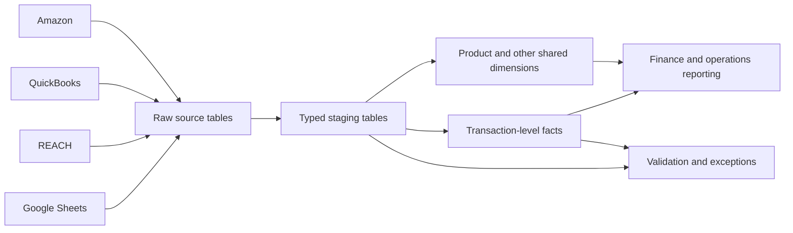

# Deliverable 1: proposed BigQuery data model

My goal is to give finance one place to trace a reported number back to the source record and the rule used to transform it. I would use one BigQuery model whether the company chooses native Google Cloud tools or managed connectors.

## Layers

| Layer | BigQuery datasets | What I would put there |
|---|---|---|
| **Bronze / raw** | `raw_amazon`, `raw_qb`, `raw_reach`, `raw_sheets` | The source record as received, plus load time, source file/report, row hash, and schema version |
| **Silver / staging** | `stg_finance` | Renamed and typed fields, normalized identifiers, UOM conversions, and source-specific validation |
| **Silver / core** | `core_finance` | Shared dimensions, identifier mappings, and transaction-level facts |
| **Gold / reporting** | `mart_finance`, `mart_operations` | Contribution margin, inventory, reconciliation, and cash reporting |
| **Controls** | `dq_monitoring`, `quarantine` | Load history, test results, schema changes, unresolved records, and dollar exposure |

The Bronze/Silver/Gold names are useful shorthand. The more important design choice is that raw evidence, business rules, and reporting outputs are kept separate.

## Main tables and keys

| Table | Grain | Key or join |
|---|---|---|
| `dim_product` | One version of a sellable product | `product_key`; canonical SKU and effective dates |
| `bridge_product_identifier` | One version of a SKU, alias, ASIN, or UPC mapping | identifier type + value + marketplace + effective dates |
| `dim_brand` | One brand | `brand_key` |
| `dim_channel` | One marketplace/channel | `channel_key` |
| `dim_vendor` | One vendor | `vendor_key` |
| `fct_marketplace_transaction` | One Amazon settlement row | source report/file + source row key |
| `fct_purchase_order_line` | One PO line/version | PO number + line + source update |
| `fct_inventory_snapshot` | SKU + location + disposition + snapshot time | composite source key |
| `fct_inventory_receipt` | One receipt/shipment line | receipt or shipment line ID |
| `fct_advertising_spend` | One dated campaign/ad group/SKU cost record | source advertising ID |
| `fct_gl_entry` | One QuickBooks transaction line | transaction ID + line ID |
| `mart_sku_profitability_daily` | Date + SKU + channel | reporting composite key |
| `mart_inventory_health_daily` | Date + SKU + location | reporting composite key |

I would use generated keys in the facts, but I would retain the source IDs and row hashes. This lets a reviewer move from a dashboard total to the transformed row and then back to the original source.

## How I would join the fragmented sources

I would resolve product identity before loading the core facts. The order is exact canonical SKU, approved SKU alias, and then a unique marketplace-scoped ASIN. A SKU prefix can identify a likely brand but cannot create a product key. Any conflict remains unresolved and is reported with its dollar exposure.

The fact stores the selected `product_key`, `brand_key`, the rule used, and separate confidence results for product, brand, and ASIN. This is covered in [identifier matching and confidence](identity_resolution_and_confidence.md).

## Ongoing data checks

I would run the following checks on every load:

1. Compare the observed columns and types with the approved source contract.
2. Confirm source keys are unique where they should be and log possible duplicates separately.
3. Confirm identifiers resolve to no more than one active product.
4. Tie settlement components to settlement total and PO extended costs to total landed cost.
5. Confirm every sold SKU has a product mapping and a cost, or appears in an exception report.
6. Reconcile reporting totals back to staging and, when available, to QuickBooks.
7. Show failed rows, dollar exposure, first-seen date, and owner instead of silently dropping them.

I would stop a reporting refresh for a missing required field, a material reconciliation difference, or an ambiguous product match above the agreed threshold. Smaller issues can publish with a visible warning.

The specific schema-change, snapshot, and replay rules are in [schema changes and recovery](schema_drift_replay_and_validation.md).

## Tool choice

My starting recommendation is Cloud Run/Workflows, BigQuery, Dataform, and Connected Sheets or Looker Studio. If the team values faster connector setup more than recurring software cost, managed Amazon and QuickBooks ingestion can feed the same BigQuery model. The two options are compared in [architecture options](architecture_options.md).
