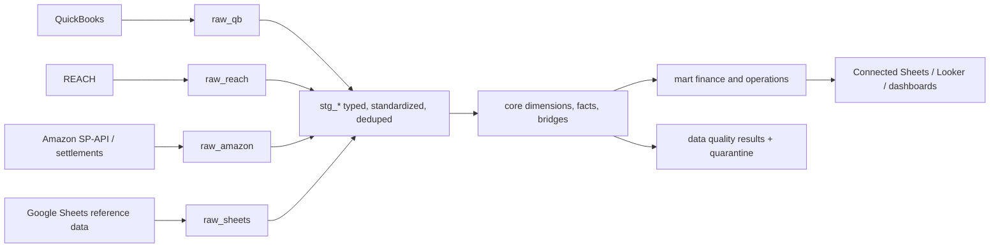

# Proposed BigQuery data model

## Layered architecture

## Reporting grain and keys

| Object | Grain | Primary/business key | Purpose |
|---|---|---|---|
| `dim_product` | One canonical SKU version | `product_key`; canonical SKU + effective dates | Product, brand, status, default UOM |
| `bridge_product_identifier` | One identifier version | type + value + marketplace + effective dates | Resolves raw SKU, ASIN, UPC, aliases |
| `dim_brand` | One brand | `brand_key` | Stable brand hierarchy |
| `dim_channel` | One sales channel/marketplace | `channel_key` | Amazon marketplace and future channels |
| `dim_vendor` | One vendor | `vendor_key` | Vendor normalization |
| `fct_marketplace_transaction` | One settlement transaction row | source file + row hash | Orders, refunds, fees, adjustments |
| `fct_purchase_order_line` | One PO line/version | PO number + line + source update | Ordered quantity, UOM, product cost, allocated freight/duty |
| `fct_inventory_snapshot` | SKU + location + disposition + timestamp | composite natural key | Fulfillable, reserved, unfulfillable, inbound |
| `fct_inventory_receipt` | One receipt event | receipt/shipment line ID | Separates PO intent from actual receipts |
| `fct_advertising_spend` | Date + campaign/ad group + advertised SKU | source ad cost ID | Causal SKU/campaign ad attribution |
| `fct_gl_entry` | One accounting entry line | QuickBooks transaction + line | Reconciliation to the general ledger |
| `mart_sku_profitability_daily` | Date + brand + SKU + channel | composite reporting key | CM1 and attributable CM2 |
| `mart_inventory_health_daily` | Date + SKU + location | composite reporting key | Days cover, inbound, aging, risk flags |

Use surrogate integer keys in facts for performance and stable history, but preserve raw business IDs and source-row hashes for traceability. Product identifiers should be effective-dated so aliases can change without rewriting historical facts.

## Data-quality operating model

Quality is a pipeline, not a cleanup exercise:

1. **Contract checks:** expected columns, types, accepted values, period coverage, and source freshness.
2. **Identity checks:** unique canonical SKU; marketplace-scoped ASIN uniqueness; aliases must resolve to exactly one product.
3. **Financial checks:** settlement components equal settlement total; PO quantity x unit cost + freight/duty equals total cost; mart totals reconcile to staging and then to QuickBooks.
4. **Completeness checks:** every sold SKU maps to a product and cost; unallocated charges are classified but never silently dropped.
5. **Quarantine and ownership:** bad rows land in an exception table with severity, source row, first seen, owner, status, and resolution—not in email or hidden spreadsheet tabs.
6. **Observability:** publish row counts, amount deltas, freshness, mapping coverage, and test pass rate. Block finance marts on critical failures; warn on immaterial exceptions.

Recommended tooling: scheduled ingestion to GCS/BigQuery, dbt or Dataform for transformations/tests, Cloud Composer or Workflows for orchestration, and a lightweight alert path to Slack/email. Keep finance-owned mappings in a governed Sheet only as an input; snapshot every version into BigQuery.

