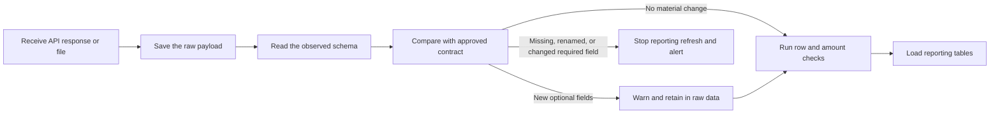

# Handling schema changes, duplicates, and historical recovery

Amazon can add, remove, or rename API/report fields without the finance team being ready for it. I would treat the expected source schema as a versioned contract and compare every new load with that contract before refreshing the reporting tables.

## What I would record on every run

- Source system and endpoint/report.
- API or report version, when available.
- Extraction time and requested date window.
- Observed field names, types, nullability, and column order.
- A hash of the observed schema.
- Source row count, loaded row count, and amount totals.
- Raw payload/file hash and code version.
- Final run status and any validation errors.

The example implementation is in [the BigQuery control SQL](../sql/bigquery/07_schema_drift_and_replay.sql). The repository also contains an [Amazon settlement contract](../contracts/amazon_settlements.schema.json) and a [Python header audit](../analysis/schema_contract_audit.py).

## How the alert would work

I would classify the differences this way:

| Result | Example | Action |
|---|---|---|
| Information | Column order changed, but parsing uses column names | Record it and continue |
| Warning | Three optional fields were added | Keep them in raw data, notify the owner, and do not expose them in reporting until reviewed |
| Error | Required field removed or renamed; type or nested mode changed; duplicate column name | Save the raw payload but stop the Silver/Gold refresh |
| Critical | The change causes a financial tie-out difference or changes a closed period | Stop publication and escalate to finance/data owners |

A column rename normally appears as one expected column missing and one new column added. If the missing column is required, the load stops until the contract or source mapping is updated.

Example alert:

> Amazon settlements: 3 new fields detected and required field `sku` is missing. The raw response was saved, but the reporting refresh was stopped. Review pipeline run 2026-08-25T07:00Z.

## Tables used for the audit trail

| Table | One row represents |
|---|---|
| `pipeline_run` | One attempt to load a source |
| `schema_contract` | One approved field and contract version |
| `schema_snapshot_header` | One observed source schema for a run |
| `schema_snapshot_field` | One field in the observed schema |
| `schema_drift_event` | One added, removed, renamed, type, mode, or order difference |
| `dedup_audit` | The duplicate/replay result for one model run |

## Duplicate handling

I would not run `SELECT DISTINCT` over finance data and assume the problem is solved.

- Raw/Bronze keeps the source evidence. It is not deduplicated based on business values.
- Loading the same report twice should be idempotent. I would use the source report ID plus row number, or the API event ID when one is available.
- If the same source record is replayed unchanged, the reporting layer keeps one current version and records the replay in `dedup_audit`.
- If two rows have identical amounts and identifiers but different source record keys, I would keep both and flag them as possible business duplicates. They may represent two real transactions.
- The audit records rows received, rows published, replayed rows, possible business duplicates, affected dollars, and the rule version.

The same load would also test required values, accepted transaction types, unique source keys, date coverage, row counts, amount totals, product mapping, and reconciliation back to the source.

## Data and schema snapshots

I would save the original API response or file in a date-partitioned Cloud Storage path and keep a manifest linking it to the pipeline run. Schema snapshots and drift events are small, so I would retain their history rather than overwrite it.

For recovery:

- Use BigQuery time travel for a recent accidental change.
- Create scheduled table snapshots for close-critical reporting tables that need a longer recovery window.
- Save the source manifest, schema hash, mapping version, row counts, financial totals, and code commit as part of the month-end close evidence.

This makes it possible to explain why a historical report changed and, when necessary, rerun it using the source and mapping versions that were active at the time.

## Google Sheets

I would use Google Sheets for finance-maintained reference data such as SKU aliases, case packs, or approved overrides, but I would not treat the live Sheet as historical evidence.

For the lower-cost GCP option:

1. Use a BigQuery external table when finance needs direct access to the governed Sheet.
2. On a schedule, copy the Sheet range into a dated raw BigQuery table, or export it to Cloud Storage first.
3. Save the Sheet ID, tab/range, modified time, schema hash, row hashes, and pipeline run ID.
4. Check required headers, duplicate keys, effective dates, and product relationships before merging approved changes.

A managed connector can replace the extraction step, but I would still keep the dated copy and run the same checks. Otherwise a formula or mapping edit could change closed history without leaving a useful audit trail.

## Google Cloud references

- [BigQuery INFORMATION_SCHEMA.COLUMNS](https://docs.cloud.google.com/bigquery/docs/information-schema-columns)
- [BigQuery table snapshots](https://docs.cloud.google.com/bigquery/docs/table-snapshots-intro)
- [BigQuery time travel](https://docs.cloud.google.com/bigquery/docs/time-travel)
- [BigQuery external tables over Google Drive and Sheets](https://docs.cloud.google.com/bigquery/docs/external-data-drive)
