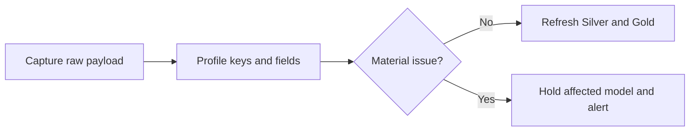

# Schema drift, validation, and replay

The rule is: **capture first, validate before publication**. Raw history stays available even when a required reporting field changes.

## Controls by stage

| Stage | Check |
|---|---|
| Arrival | Feed freshness, connector status, requested date window, row count, retries |
| Bronze | Valid JSON/file, source metadata, payload hash, duplicate ingestion key |
| Payload contract | Added/removed keys and observed JSON types |
| Silver | Required values, tolerant-cast null rates, identifiers, uniqueness, arithmetic |
| Gold | Source totals, Amazon-to-QuickBooks reconciliation, closed-period changes |

For each run, store the source, endpoint/report, account, extraction window, load time, connector run ID, code/contract version, row count, amount totals, payload hash, status, and error.

## JSON-aware drift detection

A native `JSON` Bronze table has a stable table schema even when Amazon changes fields inside the payload. Therefore:

- Use `INFORMATION_SCHEMA` for the outer table/envelope.
- Use `JSON_KEYS(payload, mode => 'lax recursive')` for payload keys.
- Track `JSON_TYPE` and Silver cast success for important fields.
- Ignore JSON key order; JSON objects do not preserve meaningful field order.
- Parse CSV reports by header name. Record order-only changes as information.

A rename appears as one expected key missing and one new key added. Do not auto-map based only on similar names; update the versioned contract after review.

## Tolerant Silver model

```sql
SELECT
  LAX_STRING(payload.order_id) AS order_id,
  COALESCE(
    LAX_FLOAT64(payload.total_revenue),
    LAX_FLOAT64(payload.revenue_total)
  ) AS total_revenue
FROM raw_amazon.api_payload;
```

Tolerant parsing buys review time, but it can also return null instead of failing. A scheduled test therefore compares required-field null rates with the approved threshold and trailing baseline.

## Alert flow



| Severity | Example | Action |
|---|---|---|
| Information | Order changed; optional key added | Log and continue |
| Warning | Type mix or null rate increases | Continue Bronze; review during business hours |
| Error | Required key missing/renamed | Continue Bronze; stop affected Silver/Gold |
| Critical | Financial tie-out or closed period changes materially | Stop publication and escalate |

BigQuery Scheduled Queries can return one row per breached rule. Cloud Monitoring alerts when that row count is greater than zero. dbt source freshness and data tests cover model-level checks.

## Duplicates and replay

- Bronze retains the source evidence; do not use blanket `SELECT DISTINCT` on finance data.
- Make reloads idempotent with source event/report ID plus row number, or another immutable ingestion key.
- Keep two source records with different source keys even when their amounts match; flag possible business duplicates separately.
- Record rows received, replayed, published, quarantined, and their dollar exposure.
- Retain the raw payload, schema/key snapshot, mapping version, financial totals, and code commit used for month-end.

Use BigQuery time travel for recent mistakes and scheduled snapshots where finance needs a longer recovery window. Test replay with a real prior run before calling the process production-ready.

## Google Sheets

Sheets can hold finance-owned aliases, case packs, and approved overrides, but the live Sheet is not historical evidence. Copy it to a dated BigQuery table on a schedule and retain Sheet ID, tab/range, modified time, row hashes, and run ID. Validate headers, duplicate keys, effective dates, and product relationships before publishing changes. Also worth considering since Google Sheets is capable, is there a Google Sheet that provides mapping for SKU's and ASIN? this as a live sheet can be fed to the Big Query as a source of truth, allowing for updates as needed as things change.

## References

- [BigQuery JSON functions](https://docs.cloud.google.com/bigquery/docs/reference/standard-sql/json_functions)
- [Scheduled-query alerts](https://docs.cloud.google.com/bigquery/docs/create-alert-scheduled-query)
- [dbt with BigQuery](https://docs.getdbt.com/guides/bigquery)
- [dbt source freshness](https://docs.getdbt.com/reference/resource-properties/freshness)
- [BigQuery table snapshots](https://docs.cloud.google.com/bigquery/docs/table-snapshots-intro)
- [BigQuery time travel](https://docs.cloud.google.com/bigquery/docs/time-travel)
